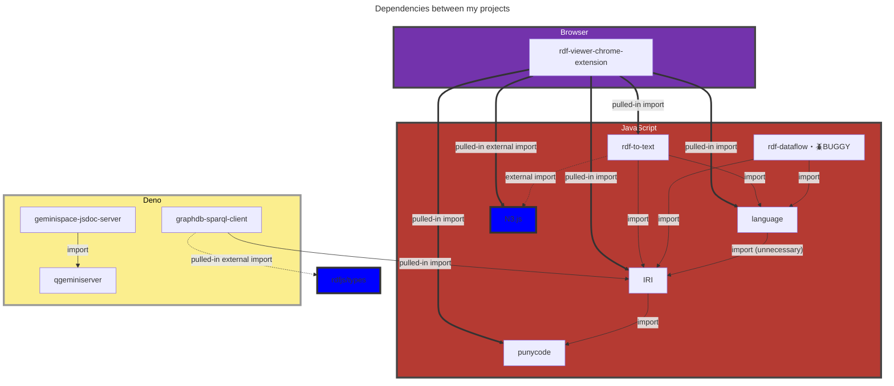

# my-projects

```mermaid
---
title: Dependencies between my projects
---
flowchart TD
    subgraph javascript["JavaScript"]
        punycode
        IRI
        language
        rdf-dataflow["rdf-dataflow・🪲BUGGY"]
        rdf-to-text
        n3["N3.js"]:::external
    end

    subgraph browser["Browser"]
        rdf-viewer-chrome-extension
    end

    subgraph deno["Deno"]
        graphdb-sparql-client
        qgeminiserver
        geminispace-jsdoc-server
    end

    rdfjs-types["rdfjs/types"]:::external

    IRI -- import --> punycode
    language -- import (unnecessary) --> IRI
    rdf-dataflow -- import --> IRI
    rdf-dataflow -- import --> language
    rdf-to-text -. external import .-> n3
    rdf-to-text -- import --> IRI
    rdf-to-text -- import --> language
    rdf-viewer-chrome-extension == pulled-in import ==> language
    rdf-viewer-chrome-extension == pulled-in import ==> IRI
    rdf-viewer-chrome-extension == pulled-in import ==> punycode
    rdf-viewer-chrome-extension == pulled-in import ==> rdf-to-text
    rdf-viewer-chrome-extension == pulled-in external import ==> n3
    geminispace-jsdoc-server -- import --> qgeminiserver
    graphdb-sparql-client -- pulled-in import --> IRI
    graphdb-sparql-client -. pulled-in external import .-> rdfjs-types

    click punycode "https://github.com/doga/punycode"
    click IRI "https://github.com/doga/IRI"
    click language "https://github.com/doga/language"
    click rdf-dataflow "https://github.com/doga/rdf-dataflow"
    click rdf-to-text "https://github.com/doga/rdf-to-text"
    click rdf-viewer-chrome-extension "https://github.com/doga/rdf-viewer-chrome-extension"
    click n3 "https://github.com/rdfjs/N3.js"
    click rdfjs-types "https://github.com/rdfjs/types"
    click graphdb-sparql-client "https://jsr.io/@arma/graphdb-sparql-client"
    click geminispace-jsdoc-server "https://jsr.io/@arma/geminispace-jsdoc-server"
    click qgeminiserver "https://jsr.io/@arma/qgeminiserver"

    style deno fill:#F8DF20,stroke:#333,stroke-width:4px,color:black,opacity:0.5;
    style browser fill:#641DA4,stroke:#333,stroke-width:4px,color:white,opacity:0.9;
    style javascript fill:#AE251C,stroke:#333,stroke-width:4px,color:white,opacity:0.9;
    classDef external fill:blue,stroke:#333,stroke-width:4px;
```
