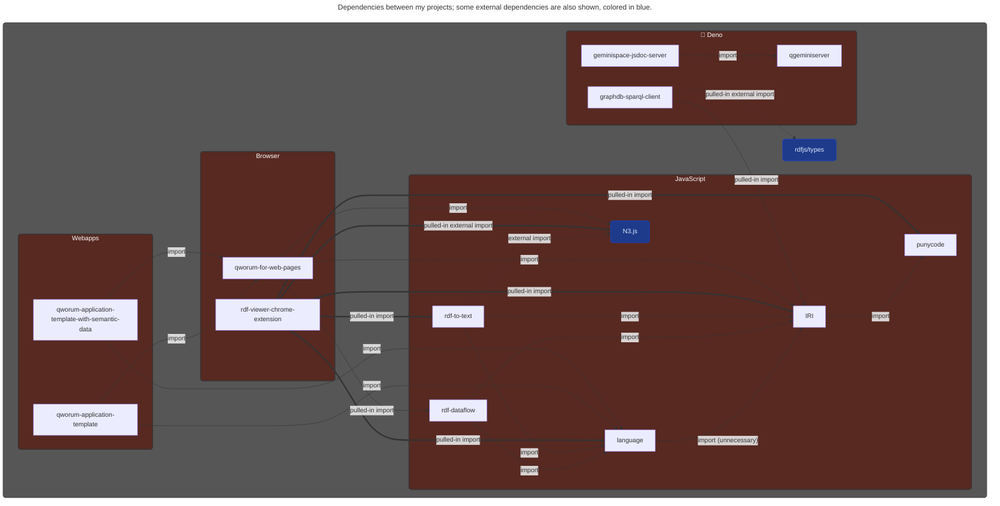

# my-projects

```mermaid
---
title: Dependencies between my projects; some external dependencies are also shown, colored in blue.
---
flowchart TD
    subgraph all[" "]
        subgraph javascript["JavaScript"]
            punycode
            IRI
            language
            rdf-dataflow["rdf-dataflow"]
            rdf-to-text
            n3["N3.js"]:::external
        end

        subgraph browser["Browser"]
            rdf-viewer-chrome-extension
            qworum-for-web-pages
        end

        subgraph webapps["Webapps"]
            qworum-application-template
            qworum-application-template-with-semantic-data
        end

        subgraph deno["🦕 Deno"]
            graphdb-sparql-client
            qgeminiserver
            geminispace-jsdoc-server
        end

        rdfjs-types["rdfjs/types"]:::external
    end

    %% ═══ Edges ═══
    IRI -- import --> punycode
    language -- import (unnecessary) --> IRI
    rdf-dataflow -- import --> IRI
    rdf-dataflow -- import --> language
    rdf-to-text -. external import .-> n3
    rdf-to-text -- import --> IRI
    rdf-to-text -- import --> language
    rdf-viewer-chrome-extension == pulled-in import ==> language
    rdf-viewer-chrome-extension == pulled-in import ==> IRI
    rdf-viewer-chrome-extension == pulled-in import ==> punycode
    rdf-viewer-chrome-extension == pulled-in import ==> rdf-to-text
    rdf-viewer-chrome-extension == pulled-in external import ==> n3
    geminispace-jsdoc-server -- import --> qgeminiserver
    graphdb-sparql-client -- pulled-in import --> IRI
    graphdb-sparql-client -. pulled-in external import .-> rdfjs-types
    qworum-for-web-pages -- pulled-in import --> rdf-dataflow
    qworum-for-web-pages -- import --> IRI
    qworum-for-web-pages -- import --> n3
    qworum-application-template -- import --> language
    qworum-application-template -- import --> qworum-for-web-pages
    qworum-application-template-with-semantic-data -- import --> language
    qworum-application-template-with-semantic-data -- import --> qworum-for-web-pages

    %% ═══ Click targets ═══
    click punycode "https://github.com/doga/punycode"
    click IRI "https://github.com/doga/IRI"
    click language "https://github.com/doga/language"
    click rdf-dataflow "https://github.com/doga/rdf-dataflow"
    click rdf-to-text "https://github.com/doga/rdf-to-text"
    click rdf-viewer-chrome-extension "https://github.com/doga/rdf-viewer-chrome-extension"
    click n3 "https://github.com/rdfjs/N3.js"
    click rdfjs-types "https://github.com/rdfjs/types"
    click graphdb-sparql-client "https://jsr.io/@arma/graphdb-sparql-client"
    click geminispace-jsdoc-server "https://jsr.io/@arma/geminispace-jsdoc-server"
    click qgeminiserver "https://jsr.io/@arma/qgeminiserver"
    click qworum-for-web-pages "https://github.com/doga/qworum-for-web-pages"
    click qworum-application-template "https://github.com/doga/qworum-application-template"
    click qworum-application-template-with-semantic-data "https://github.com/doga/qworum-application-template-with-semantic-data"

    %% ═══ Classes ═══
    classDef external fill:#1e3a8a,stroke:#1e40af,stroke-width:2px,color:#dbeafe,rx:6,ry:6
    classDef buggy fill:#fee2e2,stroke:#dc2626,stroke-width:2px,color:#991b1b,rx:6,ry:6

    %% ═══ Styles ═══
    %%style javascript fill:#FEF3C7,stroke:#D97706,stroke-width:2px,color:#78350F,rx:6,ry:6
    %%style browser fill:#EDE9FE,stroke:#7C3AED,stroke-width:2px,color:#4C1D95,rx:6,ry:6
    %%style deno fill:#ECFEFF,stroke:#0891B2,stroke-width:2px,color:#164E63,rx:6,ry:6

    style deno fill:#58251C,stroke:#333,stroke-width:2px,color:white,rx:6,ry:6,opacity:0.9;
    style browser fill:#58251C,stroke:#333,stroke-width:2px,color:white,rx:6,ry:6,opacity:0.9;
    style javascript fill:#58251C,stroke:#333,stroke-width:2px,color:white,rx:6,ry:6,opacity:0.9;
    style webapps fill:#58251C,stroke:#333,stroke-width:2px,color:white,rx:6,ry:6,opacity:0.9;
    style all fill:#444,stroke:#333,stroke-width:2px,color:white,rx:6,ry:6,opacity:0.9;

    %%linkStyle 3 stroke:#ff3,stroke-width:4px,color:red;
```
